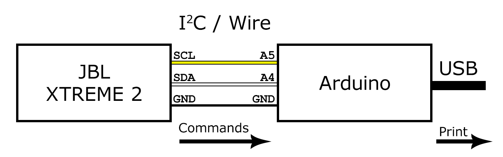

# JBL XTREME 2 BMS
Arduino scetches to analyse and emulate BMS microchip of the JBL XTREME 2 Bluetooth Speaker Battery.

## Module 1. Stub for Battery Pack

This program is designed to be written on Arduino or ATtiny85 and acts as a stub to respond to the speaker's requests via the I2C protocol, enabling the speaker to be used while connected to mains power without using a battery.

It can be used when you don't want to or cannot use the battery pack.

[Explore->](battery-stub)

## Utils

- [Address of the battery device](#address-of-the-battery-device)
- [Commands receiver](#commands-receiver)
- [Speaker emulator](#speaker-emulator)
- [Temperature measurement](#temperature-measurement)
- [Current measurement](#current-measurement)

### Address of the battery device

To find out the I2C address of the battery gas gauging device you may use the sketch from the examples:

### Commands receiver

You may use this program to log commands from the speaker.

- [commands-receiver.ino](utils/commands-receiver/commands-receiver.ino)

### Speaker emulator

You may use this program to emulate speaker sending commands to test either original Gas Gauging Device BQ28Z610 or custom software.

- [speaker-emulator.ino](utils/speaker-emulator/speaker-emulator.ino)

### Temperature measurement

This utility program helps calibrate constants for accurate temperature measurement and calculation.

[Explore->](utils/temperature-measurement)

### Current measurement

This utility program helps calibrate constants for accurate current measurement and calculation.

[Explore->](utils/current-measurement)

## Author
[@asilichenko](https://github.com/asilichenko)

## License
[MIT license](LICENSE)

## References
- Texas Instruments BQ28Z610 Technical Reference Manual: [https://www.ti.com/lit/ug/sluua65e/sluua65e.pdf](https://www.ti.com/lit/ug/sluua65e/sluua65e.pdf)

## Sources
1. Battery stub: [battery-stub.ino](battery-stub/battery-stub.ino)
2. Utils:
   - [commands-receiver.ino](utils/commands-receiver/commands-receiver.ino)
   - [speaker-emulator.ino](utils/speaker-emulator/speaker-emulator.ino)
   - [temperature-measurement.ino](utils/temperature-measurement/temperature-measurement.ino)
   - [current-measurement.ino](utils/current-measurement/current-measurement.ino)
