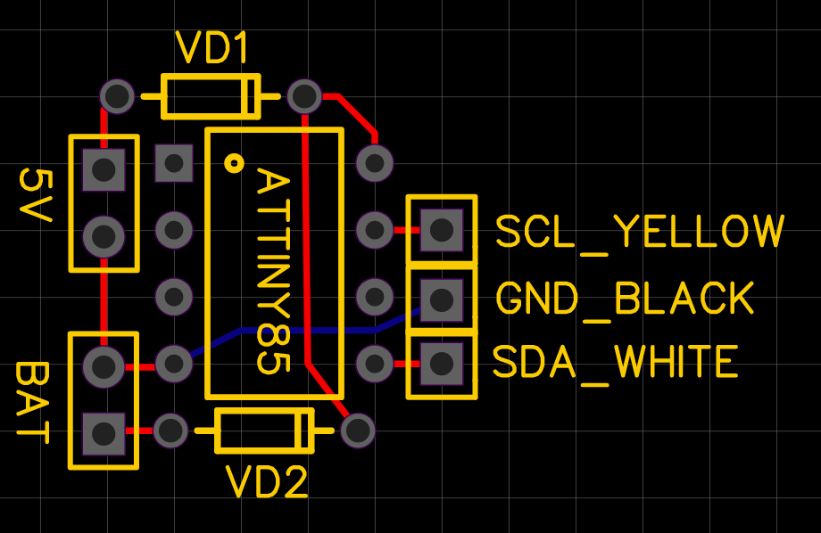
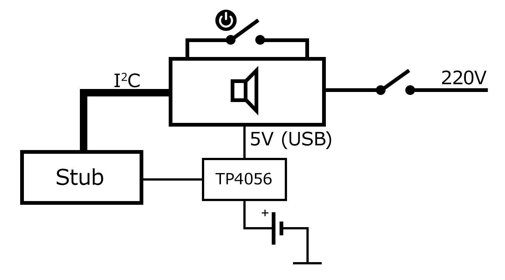
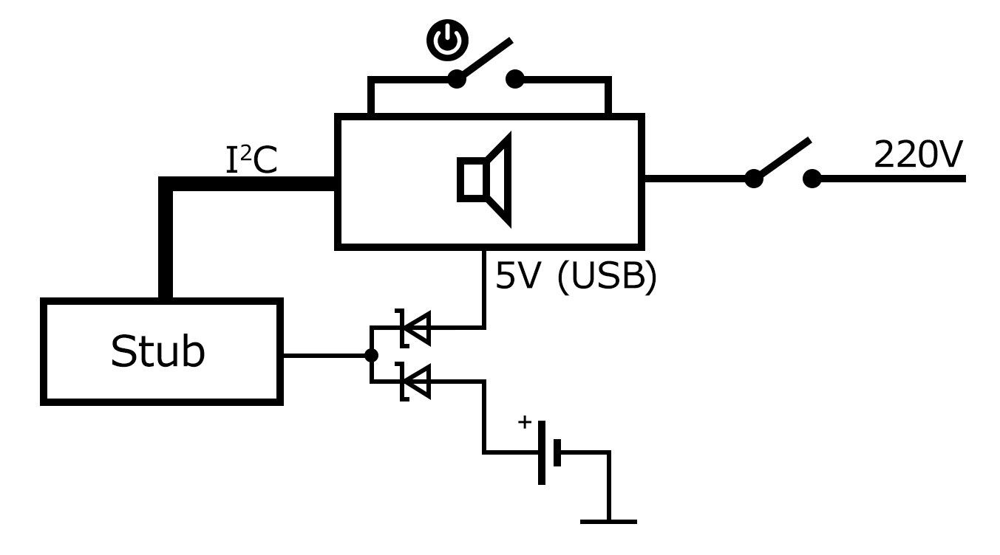
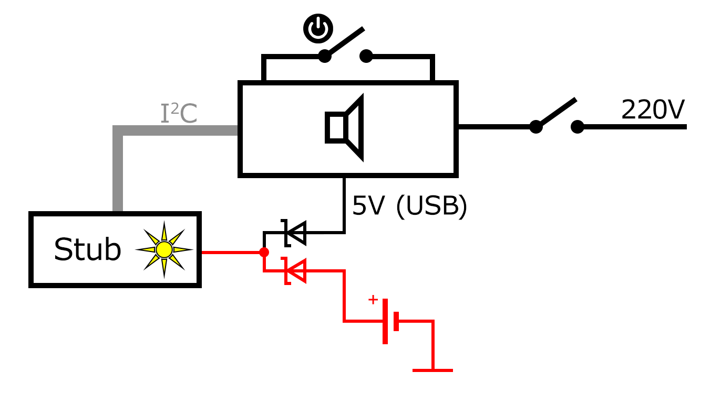
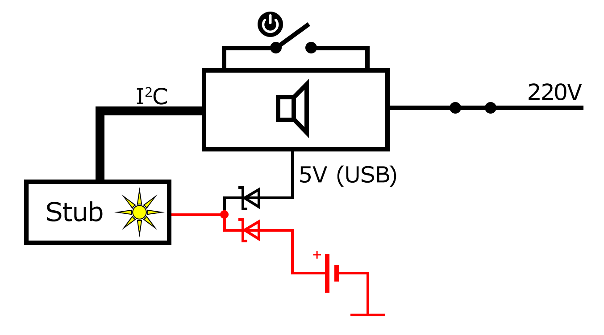
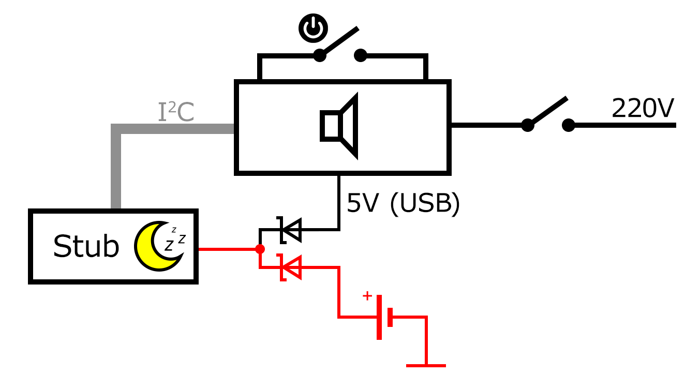

# Arduino Stub for Battery Pack for JBL XTREAME 2

This program is designed to be written on Arduino or ATtiny85 and acts as a stub to respond to the speaker's requests via the I2C protocol, 
enabling the speaker to be used while connected to mains power without using a battery.

It can be used when you don't want to or cannot use the battery pack.

## Connection

Arduino Nano:
 - A4 = SDA -> white
 - A5 = SCL -> yellow

AtTiny85:
 - 5 = SDA -> white
 - 7 = SCL -> yellow

## I2C commands

The speaker periodicaly (ones per 5-10s) sends requests with three types of commands
for Gas Gauging Device BQ28Z610:
- 0x06 - 12.1.4 0x06/07 Temperature()
- 0x08 - 12.1.5 0x08/09 Voltage()
- 0x2C - 12.1.23 0x2C/2D RelativeStateOfCharge()

The stub responses with hardcoded values:
- 3000 for Temperature() - means 3000 K = 26.85°C + 273.15;
- 8400 for Voltage() - 8400 mV = 8.4V = 2 * 4.2V
- 100 for RelativeStateOfCharge() - 100%

## Power management

The stub should have its own power supply, at least a supercapacitor, 
because the JBL speaker doesn't supply power until it receives the correct response
to the I2C commands.

There are two options on how to power the device:
- Li-Ion battery with charging module TP4056: 
  
- any battery with pair of Schottky diodes: 
  

### Power mode switching sequence
1. Disconnect the speaker from the main power.
2. Connect the stub to the speaker: 
    
   - the stub is active and powered by the battery.
3. Connect the speaker to the main power: 
     
    - the speaker regularly sends I2C requests.
    - the stub is active and powered by the battery, because the speaker does not supply power to the USB output until it is turned on by the switch.
4. Turn the switch on: 
     
    - if the speaker gets the correct I2C responses, it turns the USB output on.
5. Disconnect the speaker from the main power: 
     
    - the stub enters sleep mode after 30 seconds

### Power consumption (ATTiny 85)
- active mode: 2.8-3 mA;
- sleep mode: 83 uA.

## Author
[@asilichenko](https://github.com/asilichenko)

## License
[MIT license](/LICENSE)

## References
- Texas Instruments BQ28Z610 Technical Reference Manual: [https://www.ti.com/lit/ug/sluua65e/sluua65e.pdf](https://www.ti.com/lit/ug/sluua65e/sluua65e.pdf)

## Sources
[battery-stub.ino](battery-stub.ino)
