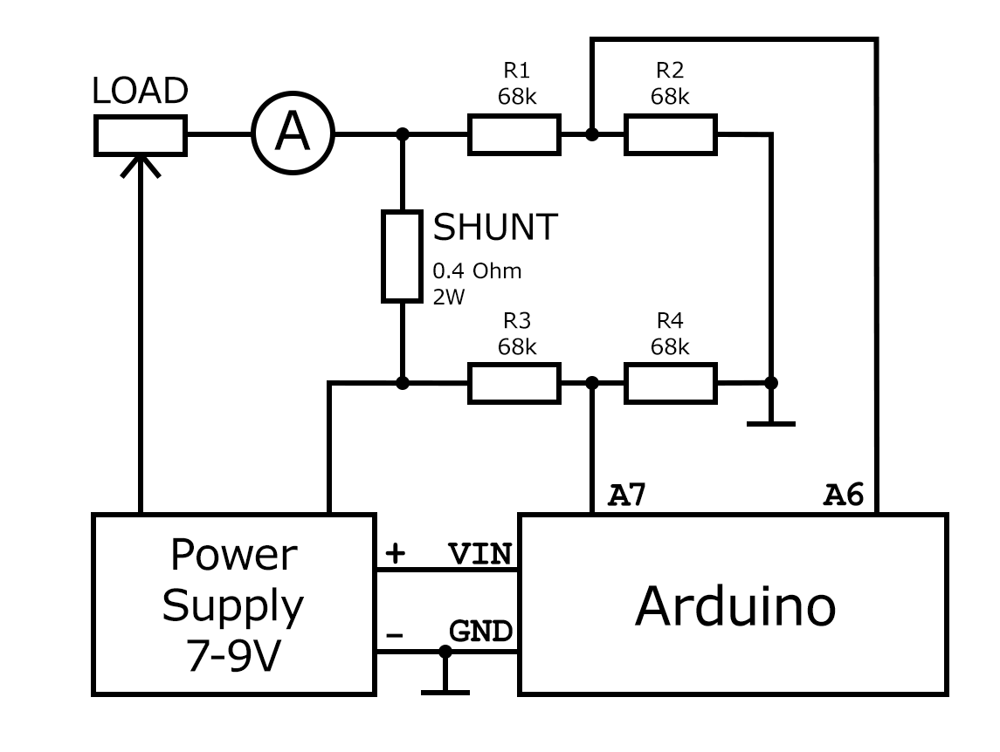

# Current Measurement Util

This utility program helps calibrate constants for accurate current measurement and calculation.

Due to the voltage used by the JBL XTREME 2 being much greater than what can be measured
by the Arduino, a voltage divider should be used.

There are two voltage dividers: one for each end of the current sense shunt.
Connect the common ends of the dividers together and ground them.
The midpoint of each divider should be connected to the corresponding Arduino pin.
The remaining ends of the dividers should be connected to the ends of the current sense shunt.

## Equipment
- Power supply 7-9 V;
- Adjustable load - to get current 100mA-1A;
- Ammeter - to measure milliampers;
- Shunt (sense resistor) ~400 milliohms (2W);
- 4 resistors for voltage divider: 68k each;

## Connection

## Process
1. Measure voltage on the Arduino 5V pin and set this value to the constant `REF_VOLT` in millivolts.
2. Set the value of the constant `MODE` equal `Mode::PRINT_ANALOG_VALUES`: you may check raw analog values from the pins.
3. Set the value of the constant `MODE` equal `Mode::MEASURE`.
4. Measure voltages on the each end of the shunt.
5. Set the values of the constants:
   - `VOLTAGE_DIVIDER_RATIO_1` = voltage on the one end of the shunt divided by `vDivider1`;
   - `VOLTAGE_DIVIDER_RATIO_2` = voltage on the other end of the shunt divided `vDivider2`;
6. Check wether `vShunt1` and `vShunt2` are correct now, otherwise - adjust the voltage dividers ratio constants.
7. Pass through the shunt different currents and calculate the average resistance of the shunt:
   - `R_SHUNT = vShuntDrop / current`;
8. Adjust `R_SHUNT` while calculated current become accurate enouph.

## Author
[@asilichenko](https://github.com/asilichenko)

## License
[MIT license](/LICENSE)

## Sources
- [current-measurement.ino](current-measurement.ino)
